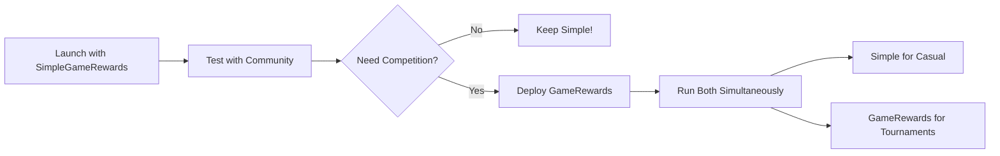

# Which Contract Should You Use?

Choose between **SimpleGameRewards** (permissionless) or **GameRewards** (signature-verified) based on your needs.

## Quick Decision Tree

```
Do you need strong anti-cheat protection?
├─ YES → Use GameRewards (signature-verified) ✅
│   └─ Best for: Tournaments, high-value rewards, competitive games
│
└─ NO → Use SimpleGameRewards (permissionless) ✅
    └─ Best for: Casual games, airdrops, demos, trusted communities
```

## Side-by-Side Comparison

| Feature | **SimpleGameRewards** 🎮 | **GameRewards** 🔐 |
|---------|--------------------------|-------------------|
| **User Experience** | ⭐⭐⭐⭐⭐ Perfect | ⭐⭐⭐ Good |
| **Setup Complexity** | ⭐⭐⭐⭐⭐ Very Easy | ⭐⭐ Complex |
| **Anti-Cheat** | ⭐⭐ Basic | ⭐⭐⭐⭐⭐ Strong |
| **Gas Cost** | $0.01-0.02 | $0.02-0.05 |
| **Decentralization** | ⭐⭐⭐⭐⭐ Fully | ⭐⭐⭐ Good |

## Detailed Comparison

### 🎮 SimpleGameRewards (NEW!)

**The Flow:**
```
Player → Connect Wallet → Play Game → Click Claim → Done! ✅
```

**✅ Pros:**
- **Zero setup required** - Deploy and it just works!
- **No verifier needed** - Anyone can claim immediately
- **Lower gas costs** - ~50% cheaper per claim
- **Fully permissionless** - True Web3 experience
- **No backend** - Pure frontend + smart contract
- **Better UX** - Players don't need to understand verifiers

**❌ Cons:**
- **Can be cheated** - Players can claim fake scores
- **Limited by caps** - Max reward per claim (default 1000 JUMP)
- **Cooldown dependent** - Main anti-spam mechanism
- **Not suitable for competition** - Can't trust scores

**Best For:**
- ✅ Casual/fun games
- ✅ Marketing campaigns
- ✅ Token airdrops via gameplay
- ✅ Community events
- ✅ Demos and testing
- ✅ Low-stakes rewards

**Anti-Cheat:**
- ⏰ Cooldown period (1 hour)
- 📊 Maximum reward cap (1000 JUMP)
- 🎯 Minimum score requirement (10 points)
- 💰 Contract balance control

**Setup Time:** **5 minutes**

---

### 🔐 GameRewards (Original)

**The Flow:**
```
Player → Connect Wallet → Owner Sets Verifier → Play Game → Sign Message → Claim ✅
```

**✅ Pros:**
- **Strong anti-cheat** - Signature verification prevents fake scores
- **Flexible limits** - Can set any reward amounts
- **Audit trail** - All claims verifiable on-chain
- **Tournament ready** - Trustworthy for competitions
- **Stats tracking** - Full player history

**❌ Cons:**
- **Verifier setup required** - Extra step before claiming
- **Higher gas costs** - ~2x more expensive
- **Complex for users** - Need to understand verification
- **Backend option** - May need backend for multi-user
- **Wallet-specific** - Verifier must match signer

**Best For:**
- ✅ Competitive tournaments
- ✅ High-value rewards
- ✅ Leaderboard-based games
- ✅ Games where fairness matters
- ✅ Multi-player competitions
- ✅ Verified achievements

**Anti-Cheat:**
- 🔐 Signature verification (cryptographic proof)
- 🎯 Nonce system (prevents replay attacks)
- ⏰ Cooldown period (1 hour)
- 💰 Contract balance control

**Setup Time:** **15-20 minutes**

---

## Cost Comparison

### SimpleGameRewards
```
Deployment: ~1,200,000 gas ($0.20-0.50)
Claim: ~60,000 gas ($0.01-0.02)
Fund Contract: ~50,000 gas ($0.01)

Total for 100 players: $1.20-$2.50
```

### GameRewards
```
Deployment: ~2,500,000 gas ($0.40-1.00)
Claim: ~120,000 gas ($0.02-0.05)
Fund Contract: ~50,000 gas ($0.01)

Total for 100 players: $2.40-$5.50
```

## Real-World Examples

### When to Use SimpleGameRewards

**Example 1: Marketing Campaign**
> "We want to give 100 JUMP to anyone who plays our game for 5 minutes"
- ✅ Perfect use case!
- Low stakes, easy onboarding
- Cooldown prevents spam

**Example 2: Community Event**
> "Host a weekend game jam where players earn tokens"
- ✅ Great fit!
- Trusted community
- Fun > competition

**Example 3: Demo/Testing**
> "Testing game mechanics before full launch"
- ✅ Ideal!
- Quick iteration
- Low complexity

### When to Use GameRewards

**Example 1: Tournament**
> "Top 10 players win $1000 in tokens based on score"
- ✅ Must use GameRewards!
- High stakes require verification
- Fairness critical

**Example 2: Competitive Leaderboard**
> "Monthly leaderboard, top scorer gets 10,000 JUMP"
- ✅ GameRewards required!
- Need proof of legitimate scores
- Public verification needed

**Example 3: Achievement System**
> "Unlock rare NFT by reaching score 10,000"
- ✅ Use GameRewards!
- Achievement must be verified
- No cheating allowed

## Migration Path

### Start Simple, Upgrade Later



**Recommended Approach:**
1. **Phase 1**: Launch with SimpleGameRewards
   - Get users playing quickly
   - Test game mechanics
   - Build community

2. **Phase 2**: Add GameRewards for tournaments
   - Keep SimpleGameRewards for casual play
   - Use GameRewards for competitive events
   - Best of both worlds!

## Setup Difficulty

### SimpleGameRewards
```bash
Time: 5 minutes
Steps: 3

1. Deploy contract in Remix (2 min)
2. Fund with JUMP tokens (2 min)
3. Update .env.local (1 min)

Done! ✅
```

### GameRewards
```bash
Time: 15-20 minutes
Steps: 6

1. Deploy contract in Remix (2 min)
2. Set verifier address (3 min)
3. Fund with JUMP tokens (2 min)
4. Update .env.local (1 min)
5. Test signature system (5 min)
6. Troubleshoot verifier issues (0-10 min)

Done! ✅ (maybe)
```

## Technical Requirements

### SimpleGameRewards
- ✅ Solidity 0.8.20+
- ✅ OpenZeppelin contracts
- ✅ Basic React/wagmi knowledge
- ❌ NO backend needed
- ❌ NO signature generation
- ❌ NO verifier management

### GameRewards
- ✅ Solidity 0.8.20+
- ✅ OpenZeppelin contracts
- ✅ Advanced React/wagmi knowledge
- ✅ Ethers.js (for signing)
- ⚠️ Backend (optional, for multi-user)
- ⚠️ Cryptography understanding

## Our Recommendation

### For Most Use Cases: **SimpleGameRewards** 🎮

**Why?**
- Better user experience
- Faster deployment
- Lower costs
- Fewer things to break
- Web3-native flow

**Unless you need:**
- High-value rewards (>$100 per claim)
- Competitive tournaments
- Verified leaderboards
- Absolute fairness guarantee

Then use **GameRewards** 🔐

## How to Deploy

### Deploy SimpleGameRewards
```bash
See: SIMPLE_DEPLOYMENT.md
Quick start: 5 minutes
Difficulty: ⭐ Easy
```

### Deploy GameRewards
```bash
See: DEPLOYMENT.md
Quick start: 15-20 minutes
Difficulty: ⭐⭐⭐ Medium
```

## Summary Table

| Aspect | SimpleGameRewards | GameRewards |
|--------|-------------------|-------------|
| **Setup** | 5 min | 20 min |
| **Cost** | $0.01/claim | $0.03/claim |
| **UX** | ⭐⭐⭐⭐⭐ | ⭐⭐⭐ |
| **Security** | ⭐⭐ | ⭐⭐⭐⭐⭐ |
| **Use Case** | Casual | Competitive |
| **Cheating Risk** | Medium | Very Low |
| **Max Reward** | 1000 JUMP* | Unlimited |
| **Backend** | No | Optional |
| **Verifier** | No | Yes |

*Configurable, but recommended cap

---

## Still Unsure?

**Ask yourself:**

1. **Is fairness critical?**
   - YES → GameRewards
   - NO → SimpleGameRewards

2. **Do you want the easiest setup?**
   - YES → SimpleGameRewards
   - NO → Either works

3. **Are rewards high-value (>$100)?**
   - YES → GameRewards
   - NO → SimpleGameRewards

4. **Need it working in 5 minutes?**
   - YES → SimpleGameRewards
   - NO → Either works

**Most Common Choice: SimpleGameRewards** 🎮

Start simple, upgrade if needed!

